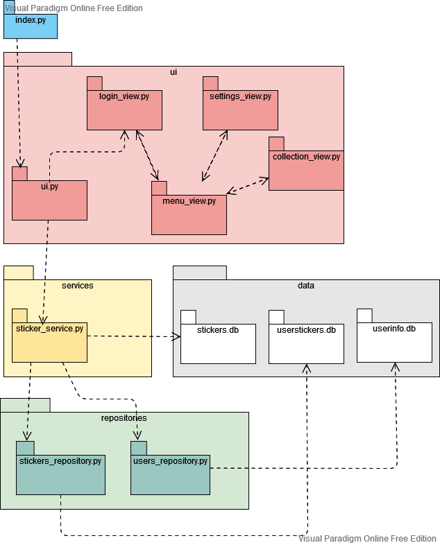
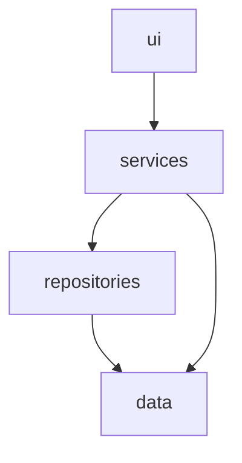

# Arkkitehtuuri

## Rakenne

Ohjelmassa ui hoitaa käyttöliittymän ja kutsuu sitten servicen kautta ohjelman toimintoja. Mikäli hoidetaan pysyväistallennusta, kutsuu services repositories toimintoja, muuten se voi itse kutsua datasta tietoa.

## Käyttöliittymä
 Kutsuu services-metodeja ja eristetty muuten logiikasta.

## Sovelluslogiikka

(TODO)

