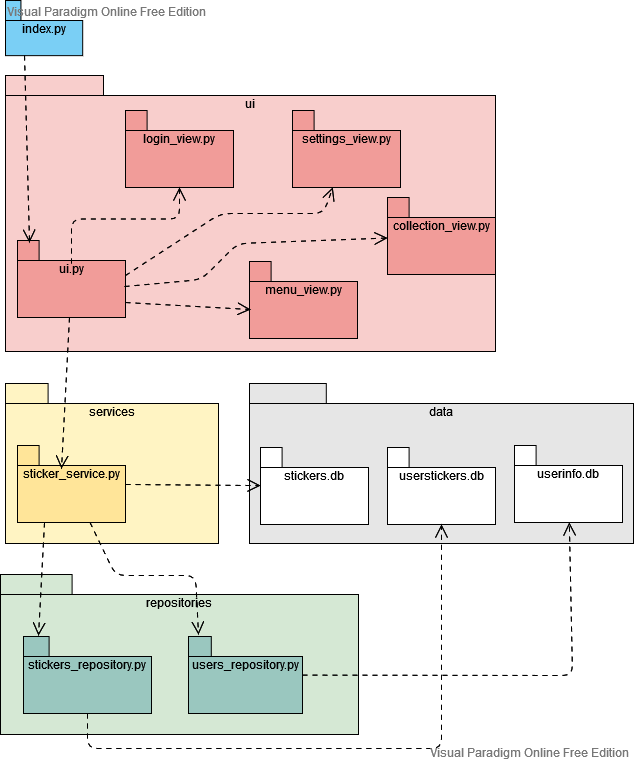
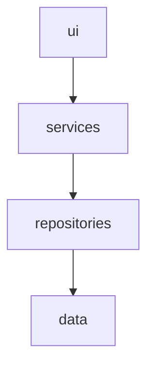
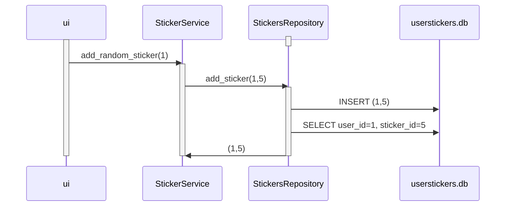

# Arkkitehtuuri

## Rakenne

Ohjelmassa ui hoitaa käyttöliittymän ja kutsuu sitten servicen kautta ohjelman toimintoja. Services kutsuu Repositories-hakemistoa etsimään ja hakemaan ja käsittelemään tietoa tietokannoista.

## Käyttöliittymä
Käyttöliittymä sisältää neljä eri näkymää.
Ohjelma avautuu kirjautumisnäkymästä (login_view), josta voidaan valita käyttäjä. Valitsemalla käyttäjän siirrytään menu-näkymään (menu_view), josta päästään kaikkii muihin valikkoihin.
- Toiminto-napit lisäävät satunnaisen tarran käyttäjälle joka on tällä hetkellä valittuna.
- Collection-nappi siirtää kokoelma-näkymään (collection_view) jossa näkyy kerätyt tarrat kyseiselle käyttäjälle.
- Settings-nappi vie asetusnäkymään (settings_view), josta käyttäjä voi asettaa tämän käyttäjän asetuksia.
 
Käyttöliittymän napit kutsuvat services-luokan metodeja ja on eristetty muuten sovelluslogiikasta.

## Sovelluslogiikka

## Tietojen tallennus

Sovellus ei muokkaa tietokantaa stickers.db ollenkaan, vaan pelkästään lukee sen tietoja. Tietokantaa userstickers.db muokataan, ja se pitää huolta siitä, mitä tarroja kullakin käyttäjällä on. Se vastaa pysyväistallennuksesta, ja säilyttää tiedot myös jos ohjelma suljetaan.
Huomioi, että testien ajo tyhjentää userstickers.db ja alustaa sen tyhjäksi merkinnällä (0,0), eli käyttäjällä 0 on tarra numero 0.

## Päätoiminnallisuudet

### Tarran lisääminen

### Kokoelman avaaminen

(TODO)

### Käyttäjän asetusten vaihto

(TODO)

### Muut toiminnallisuudet
Käyttäjä painaa käyttöliittymän nappeja, käyttöliittymä kutsuu Services-oliota, joka kutsuu repositoryä joka huolehtii toiminnan toteuttamisesta.
