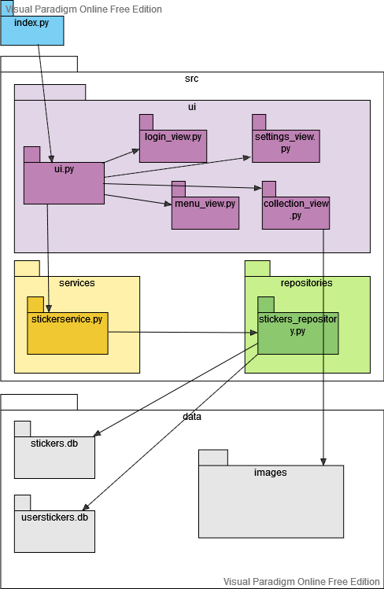
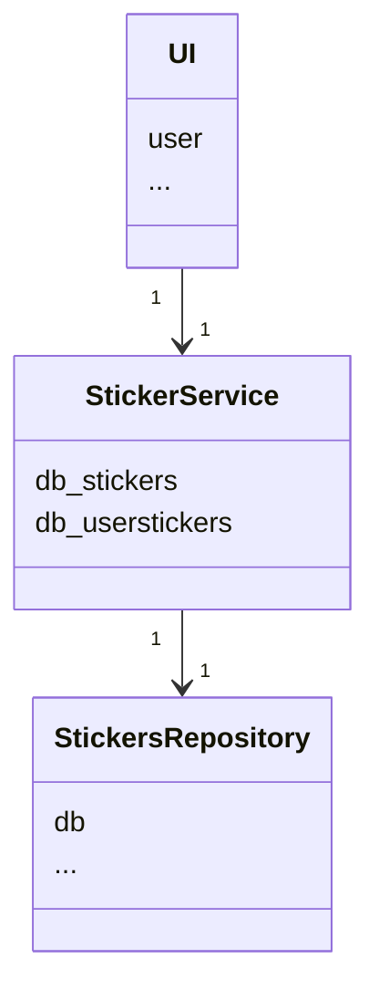
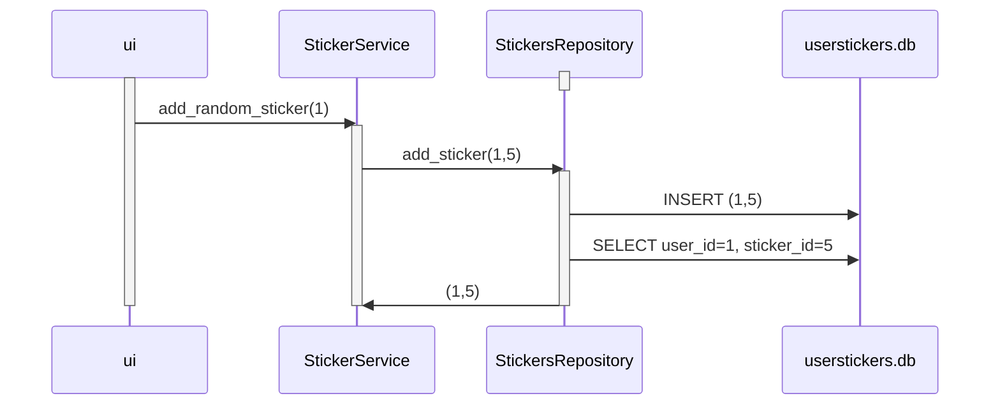
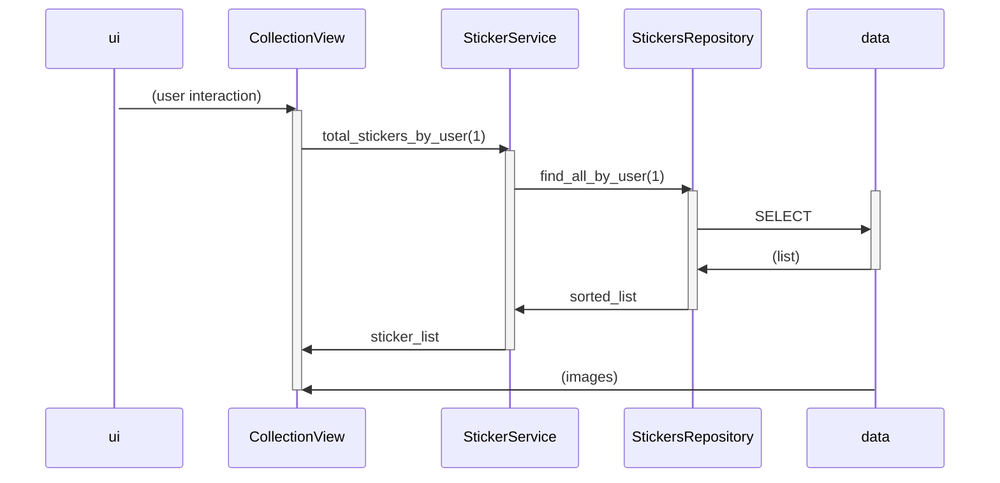

# Arkkitehtuuri

## Rakenne

Ohjelmassa ui hoitaa käyttöliittymän ja kutsuu sitten serviceä joka huolehtii sovelluslogiikasta. Services kutsuu Repositoriesia kun haetaan tai tallennetaan tietoa tietokantoihin. Kaikki data löytyy data-kansiosta, mukaanlukien tietokannat ja kuvat.

## Käyttöliittymä
Käyttöliittymä on graafinen sisältää neljä eri näkymää:
- Kirjautumisnäkymä (login_view)
- Päävalikko (menu_view)
- Asetukset (settings_view)
- Kokoelma (collection_view)

Jokainen näkymä on oma luokkansa ja näkymistä näkyy vain yksi kerrallaan. UI-luokka vastaa eri näkymien näyttämisestä ja edellisten sulkemisesta. Käyttöliittymä kutsuu StickerService-luokan metodeja ja on muuten pääosin eristetty sovelluslogiikasta.

## Sovelluslogiikka

Ohjelmaa käytetään graafisen käyttöliittymän kautta joka kutsuu StickerServiceä hoitamaan toimintoja. Kun valitaan käyttäjä, käyttöliittymä pitää huolen siitä, mikä käyttäjä on juuri nyt valittuna käyttöliittymän näkymä-oliossa, ja osaa kutsua StickerServiceä oikealle käyttäjälle.

Sovelluksen logiikka pohjautuu TodoServiceen joka vastaa ohjelman toiminnallisuudesta. Käyttäjän tiedot ja asetukset löytyvät tietokannasta, ja ne haetaan aina tarvittaessa kun ohjelma kutsuu niitä StickerServicellä, joka kutsuu StickersRepositoryä. StickerServicellä on jokaiselle toiminnolle oma metodi, esimerkiksi:
- add_random_sticker
- remove_sticker
- change_action
- find_username
- find_action

StickerService kutsuu useimmilla metodeilla StickersRepositoryä hakemaan tiedon tietokannasta userstickers.db tai stickers.db. StickersRepositoryllä on metodit useimmille toiminnoille, esimerkiksi:
- add_sticker
- remove_sticker
- change_username
- change_action
- find_action

## Tietojen pysyväistallennus ja tietokannat

Sovellus ei muokkaa tietokantaa stickers.db ollenkaan, vaan pelkästään lukee sen tietoja. Tietokantaa userstickers.db muokataan, ja se pitää huolta siitä, mitä tarroja kullakin käyttäjällä on.  Tietokannassa userstickers.db on kaksi taulua: Users ja UserStickers. Users sisältää käyttäjän tiedot sqlite-tietokantana muodossa

(user_id INTEGER, name TEXT, action1 TEXT, action2 TEXT, action3 TEXT)

ja UserStickers puolestaan sisältää tiedon mitä tarroja kullakin käyttäjällä on muodossa

(user_id INTEGER REFERENCES Users, sticker_id INTEGER REFERENCES Stickers)

StickersRepository vastaa pysyväistallennuksesta, ja säilyttää tiedot myös jos ohjelma suljetaan. Kaikki tiedon muokkaukset muuttavat ja tallentuvat suoraan pysyväistallennuksena tietokantaan.

Viimeinen erillinen tietokanta on stickers.db-tiedostossa, jota ohjelma ei muokkaa ollenkaan vaan pelkästään lukee sen tietoja. Tietokannassa on tarrojen id:t sekä niiden kuvailut muodossa 

(id INTEGER, name TEXT, description TEXT)

Huomioi, että testien ajo tyhjentää userstickers.db ja alustaa sen oletusmuotoon. UserStickers-taulu on kokonaan tyhjä poislukien arvoparin (0,0), ja Users-taulukkoon alustetaan seuraava:

| user_id | name | action1  |action2  |action3  |
| :----:|:-----| :-----|:-----|:-----|
| 1 | user1    | action1 |action2 |action3 |
| 2 | user2    | action1 |action2 |action3 |
| 3 | user3    | action1 |action2 |action3 |

Nämä ovat oletusnimet ja oletustoiminnot jotka näkyvät kun ohjelma käynnistetään eikä käyttäjä ole vielä lisännyt tai muokannut itselleen sopivia toimintoja suoritettavaksi.

## Päätoiminnallisuudet

### Tarran lisääminen

### Kokoelman avaaminen

    

### Käyttäjän asetusten vaihto

(TODO)

### Muut toiminnallisuudet
Käyttäjä painaa käyttöliittymän nappeja, käyttöliittymä kutsuu Services-oliota, joka kutsuu repositoryä joka huolehtii toiminnan toteuttamisesta.
