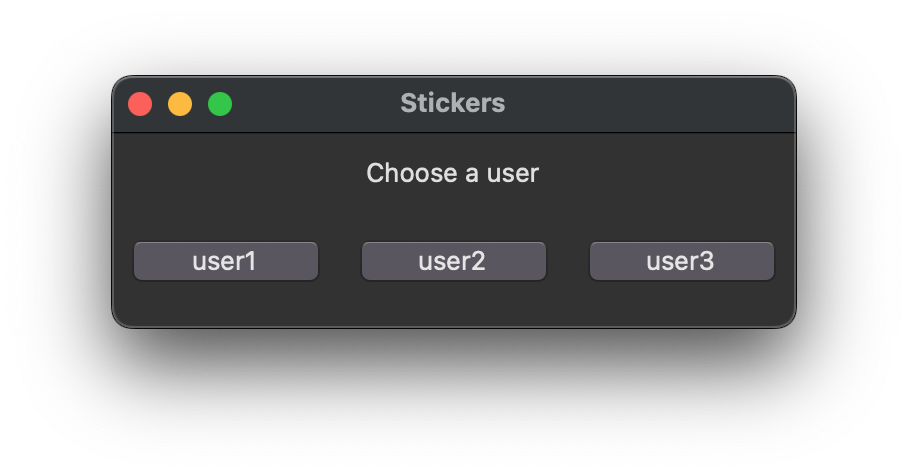
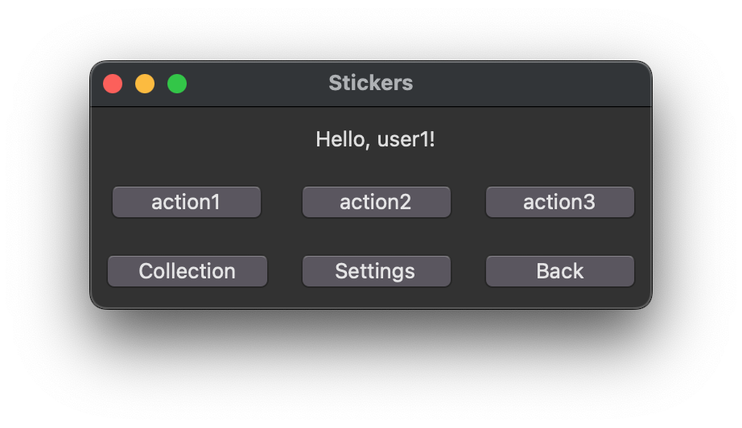
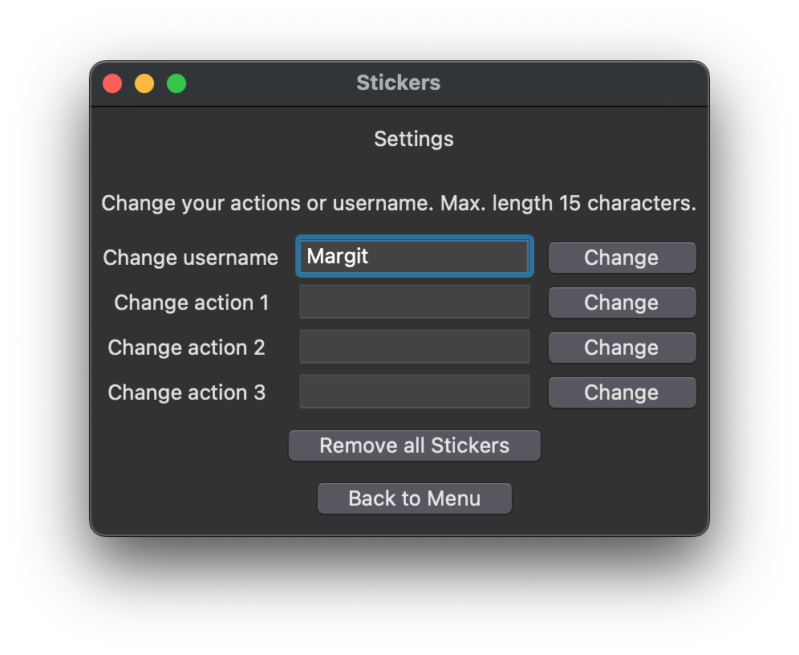
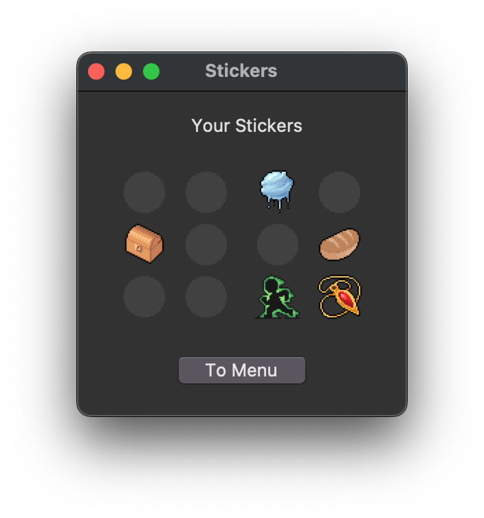

# Käyttöohje

Lataa uusin [release](https://github.com/suitsuke/ot-harjoitustyo/releases/tag/viikko6).


## Käynnistäminen

1. Avaa terminaali pääkansiossa. Asenna ensiksi riippuvuudet (kansiossa jossa on pyproject.toml):

```bash
poetry install
```

2. Käynnistä sovellus:

```bash
poetry run invoke start
```

### Ongelmatilanteissa
Varmista että poetry on ajan tasalla. Aja komento
```bash
poetry update
```

## Valikot

### Kirjautumisnäkymä

Ohjelma avautuu kirjautumisnäkymään. Valitse käyttäjätunnus jota käytät, käyttäjätunnuksia on 3 kappaletta. Pääset vaihtamaan käyttäjänimesi seuraavasta valikosta Settings-nappia painamalla.



### Päävalikko

Tässä näkymässä voit suorittaa toimintoja ja kerätä niistä tarroja. Toimintoja on 3 erilaista, ja ne on oletuksena nimetty vain action 1-3. Pääset muuttamaan toiminnot haluamiksesi Settings-napista.
Toimintonappia klikkaamalla ohjelma lisää tarran tarrakirjaan. Tarrakirjaa pääsee katsomaan Collection-nappia painamalla.
Päävalikosta pääsee lisäksi takaisin kirjautumiseen (Back-nappi) ja asetuksiin (Settings).



### Asetukset

Tässä näkymässä voit vaihtaa käyttäjänimen sekä asettaa itse käsin mistä toiminnoista haluat kerätä tarroja. Käyttäjänimen vaihtaminen onnistuu kirjoittamalla toivottu käyttäjänimi ruutuun ja painamalla Change-nappia. Käyttäjänimi muuttuu kirjautumissivulla ja päävalikosta.
Toimintoja on 3 erilaista ja jokaisen niistä voi asettaa haluamakseen kirjoittamalla uuden toiminnon ja painamalla Change-nappia. 
Halutessaan käyttäjä voi myös poistaa kaikki omistamansa tarrat painamalla "Remove all Stickers"-nappia.

Molemmissa tapauksissa maksimipituus syötteelle on 15 merkkiä sisältäen välilyönnit, ja pidemmän syötteen syöttäminen ei aiheuta muutoksia. 



### Kokoelma

Kokoelmassa näkyy kaikki kerätyt tarrat. Kokoelmasta pääsee takaisin päävalikkoon. Jos tarraa ei omisteta, on sen paikalla harmaa varjo. Kun tarra on kerätty, ilmestyy sen kuva paikalle.




