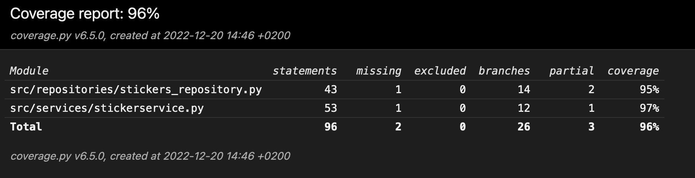

# Testausdokumentti

Ohjelmaa on testattu sekä automatisoidusti yksikkötesteillä, että manuaalisesti käyttöliittymää. Käyttöliittymälle ei ole automatisoituja testejä.

## Yksikkötestaus

### Sovelluslogiikka

Sovelluslogiikasta vastaa luokka StickerService, joka huolehtii sovelluksen logiikasta ja on erillään käyttöliittymästä. StickerServiceä testataan käyttämällä ohjelman userstickers.db-tietokantaa ja tyhjentämällä se, jonka jälkeen alustetaan uusi tietokanta, jossa on alustettu alkuarvot taulukoihin. Testi luo StickerService-olion, joka puolestaan luo itselleen oman StickersRepositoryn. Jokaisen testin jälkeen tearDown-funktio tyhjentää userstickers.db-tietokannan ja alustaa sinne uudestaan alkuarvot. Testien ajon jälkeen ohjelman tietokannat ovat oletustilassa.
Tietokantaa stickers.db ei muokata testien aikana.

### Repositorio-luokka
StickersRepository vastaa tiedon hausta ja muokkaamisesta tietokannoista. Tietokantaa stickers.db ainoastaan luetaan, ja userstickers.db voidaan myös muokata. Repositoryn testi toimii samalla logiikalla kuin sovelluslogiikasta vastaava luokka, eli tietokanta ensiksi poistetaan ja alustetaan uusiksi ennen testien ajoa ja niiden jälkeen. StickersRepositoryn testit eivät käytä tai alusta ulkoisia olioita, vaan testaavat pelkästään StickersRepository-oliota automatisoidusti. 

### Testikattavuus
Haarautumakattavuus on 96% lukuun ottamatta käyttöliittymää.

Testaamatta jäi toiminnon muuttamisen testaaminen kolmannelle toiminnolle, joka toimii täysin samoin kuin ensimmäiselle kahdelle. Lisäksi käyttäjätunnuksen muuttaminen jos syöte on liian pitkä jäi testaamatta.

## Järjestelmä- ja käyttöliittymätestaus

Tämä osa testausta on suoritettu manuaalisesti.

### Asennus ja konfigurointi
Ohjelma on luotu Mac OSX -käyttöjärjestelmällä ja sitä on testattu myös etäkäyttämällä laitoksen virtuaalista käyttöjärjestelmää Cubblilla Unix-käyttöjärjestelmällä. Unixilla on testattu Python-versiolla 3.8 ja itse ohjelma on kirjoitettu ja testattu python 3.11-versiolla.
Molemmissa tapauksissa ohjelma on käynnistetty ja ajettu käyttöohjeen mukaisesti.

### Toiminnallisuudet
Kaikki ohjelman mahdolliset toiminnallisuudet ja testaamiset on käyty läpi manuaalisesti kokeilemalla yllä mainituissa käyttöympäristöissä, ja myös yritetty virheellisiä syötteitä. Virheelliset syötteet ovat tässä ohjelmassa pääosin liian pitkiä syötteitä käyttäjänimeksi tai toiminto-napeille.

## Ohjelmaan jääneet ongelmat
- Ohjelma lisää satunnaisia tarroja käyttäjälle, mutta satunnaisuudelle ei ole luotu automatisoitua testausta.
- Testaukseen voisi olla parempi käyttää vain testin aikaisia tietokantoja, eikä muokata olemassa olevia. Nykyisessä muodossaan tietokanta userstickers.db pitäisi varmuuskopioida talteen ennen testien ajamista, ja sen jälkeen palauttaa entiselleen.
