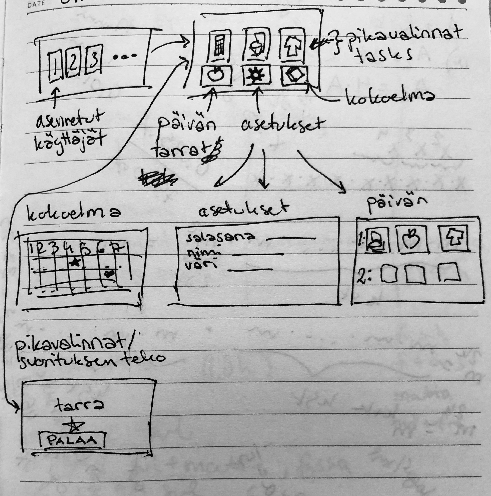

# Vaatimusmäärittely

## Sovelluksen tarkoitus

Yksinkertainen tehtäväseuranta. Sovelluksen avulla käyttäjä voi kerätä suorituskertoja erilaisista onnistuneista arjen askareista, kuten siististi syöminen, hampaiden pesu, pukeutuminen, nukkumaan meneminen. 
Jokaisesta suorituskerrasta saa satunnaisesti (tai puolisatunnaisesti) valitun tarran jota ei vielä ole aiemmin saanut tarrakirjaan.

Sovelluksen kohderyhmä on lapset niiden vanhempien avustuksella tai muut käyttäjät joilla on alentunut toimintakyky arjen askareissa.

## Käyttäjät

Sovellusta voi käyttää useampi käyttäjä kirjautumalla tai vaihtamalla käyttäjää, ja 
jokaisella käyttäjällä on eri historia ja tarrakokoelma.

## Käyttöliittymä

## Perusversion toiminnallisuus

### Ennen kirjautumista

- Käyttäjä valitsee tai luo käyttäjätunnuksen (tehty)
- Käyttäjiä 3 (tehty)
- Graafinen selkeä sopiva kirjautumisnäkymä (tehty)

### Kirjautumisen jälkeen

- Käyttäjä voi valita askareen jota suoritetaan klikkaamalla (tehty)
- Suorituksesta saa merkin kirjaan/kalenteriin, ja satunnaisesti valitun tarran joka lisätään tarrakirjaan (tehty)
- Käyttäjän keräämät tarrat (numeroitu) ja niiden tekstikuvaus tallennetaan tietokantaan. (tehty)
- Tarrat on omassa tietokannassa ja toinen tietokanta pitää huolen mikä käyttäjä (id) on kerännyt mitkäkin tarrat. (tehty)
- Käyttäjä voi avata tarrakirjan, josta näkee kaikki kerätyt tarrat (tehty)
- Asetuksista voi muuttaa käyttäjänimen ja mitä askareita tehdään (tehty)
- Asetuksista voidaan poistaa kaikki saavutetut tarrat (tehty)

## Jatkokehitysideoita

- Collection-näkymässä tarran hoverointi näyttää tarran tekstikuvailun
- Enemmän tarroja
- Kirjautumiseen voidaan asettaa salasana tai haastava kertolasku
- Käyttäjiä enemmän
- Tarrojen luokittelu eri askareiden mukaan niin että tietyntyyppiset askareet suosivat 
tietyn tyyppisiä tarroja
- Tarrojen painoitettu todennäköisyys ja random-testaaminen
- Samaa tarraa voi kerätä monta kappaletta ja se esitetään käyttäjälle kokoelmassa
- Tarrojen vaihtaminen käyttäjien välillä
- Tilastojen ja historian luominen askareista ja suoritusajoista
- Käyttäjä voi avata kalenterin/login josta näkee eri suoritetut askareet päivämäärän ja ajan mukaan
- Pisteiden kerääminen askareista ja "tarrakauppa"
